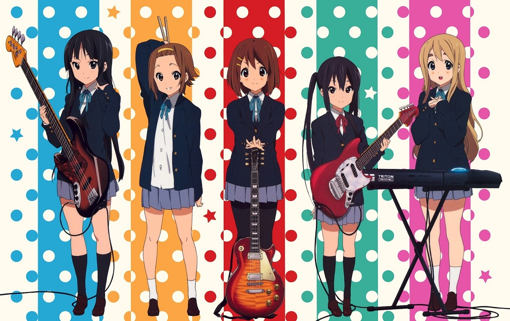

### 180427
1. HP 특강(?)을 가봤는데, 몇몇 점들이 걸려서 가지 않기로 최종 결정했다.
    - 카이 시간표 짜기가 귀찮음(...)
    - 학점이 P로 인정이 안됨
    - 낯선 환경에 혼자(나 아는 몇 안되는 사람과) 가는 것이 무서움, 번거로움
    - 현재 환경에 큰 불만이 없음

2. 노트북을 제출해서 모바일로 마크다운을 편집하고 있는데 생각보다 효율적이다. 아마 html이었다면 '<,>'를 계속 찾아서 타이핑했겠지 ㅎㅎㅎ.. 는 tab이 작동 안해서 취소


### 180426
1. Mathjax editor 관련한 두 github repository의 코드를 비교해서 해석하고 있는데, 자바스크립트 초보라서 꽤나 이해하기가 어렵다. 오늘 롤백만 다섯 번은 한 것 같다. 차라리 만들어진 것을 수정하지 말고, 백지에서 시작하는 것이 나을 수도 있겠다는 생각이 들었다. 어차피 작동하는 원리를 잘 모르기 때문에 직접 시행착오를 겪는 것이 더 빠르다는 것이다.
열심히 하면 일주일을 갈아넣어서 사용 가능한 데모 버전을 만들 수 있을 것 같다.
    - [ ] 자바스크립트 객체, 함수 구조 이해
    - [ ] mathjax, marked를 이용해서 기본적인 자바스크립트 구성
    - [ ] html/css로 데모 문서를 구성해서 테스트
    - [ ] html을 클립보드에 복사하는 기능 넣기
    - [ ] 전체적인 UI를 내 입맛에 맞게 만들기
    - [ ] 종이를 던지기(?) (어디에서는 성공하면 그렇게 한다더라)

### 180425
1. 한글과 같이 마이너한(구사할 수 있는 인구가 적은) 언어가 은근히 좋은게, 정보가 털릴 확률이 줄어든다. 어떤 정보가 중요한 개인 정보인지 한글을 모르는 이상 알기 어렵고, 알더라도 해석을 하려면 파싱 후 번역기를 돌리기 때문에 정보의 질이 떨어지기 때문이다. 또, 다른 언어와 달리 글자 하나를 이루는 더 작은 단위가 존재해서, 기계가 읽을 때 한 번 더 처리를 해야 되는 부분도 있다.

2. 창3에서 졸업연구하고 있었는데 뒤에 누가 지나가다 갑자기 엄청 놀란 후 왔던 길을 다시 돌아갔다. 이를 느끼고 오른쪽을 돌아보니까 검은 지네가 전진하고 있었다..! 다시는 창3 신청 안할거야.. (겉모습 때문에 지네에 대한 편견을 갖고 있다고 볼 수도 있지만, 그래도 보면 소름이 돋는걸 어떡하라고)

3. 여태까지 내가 본 수학 article들은 모두 앞에서 theorem들을 나열한 후 뒤에서 막 갖다 쓰는데, 이 구조가 상당히 비효율적이다. 논문이나 책처럼 종이에 프린트할 때는 어쩔 수 없지만, 습득하는 입장에서는 이런 선형 배열을 다시 입체적으로 구조화시켜야 하기 때문에, 내용이 많고 복잡할수록 이 부분이 아주 힘들어진다.

### 180424
1. 기존 티스토리 일기를 github로 이사했다. 이미지나 영상, 링크를 가져올 수가 없어서 이전 일기를 읽으면 많이 불편할 것이다(물론 나는 티스토리에 비공개 글이 있으니까 상관없다!).
    - **티스토리에서 이 글이 검색 유입이 되는 게 싫어서 옯겼다.**
    - pages를 처음 써봐서 몰랐는데, push를 하고 io에 반영될 때까지 시간이 약간 걸린다.
    - 마크다운 조아
    - ~~mathjax도 작동하게 만들 예정!(누군가 해놨겠지<<)~~ 
    
    (굳이 수학이 많이 필요한 글이라면 직접 따로 올리는 게 나을 것 같아 취소)
    - 점점 자유로운 서비스를 찾아가는 경향이 있다. 하지만 티스토리는 아직 포기할 생각은 없다. 어떤 서비스와는 달리 스킨의 html/css를 자유롭게 편집할 수 있고 일반 글을 올릴 때 html에서 금지하는 태그도 없는데 자유롭지 않다고 불평할 생각은 없다. 기본 글 에디터가 약간 삐걱거리고 개별적인 글에서 자바스크립트를 쓰지 못하지만, 그 정도는 아직은 참을 수 있다.

2. 내가 가장 지키고 싶어하는 좌우명? 은 '남에게 피해주지 말자'라는 것을 최근에 알게 되었다. 주변 사람들을 관찰하면 모든 사람이 나처럼 생각하지는 않는다.

    

### 180423
1. 비가 와서 그런지 생각이 안되고 멍만 때리고 앉아있는 나를 볼 수 있었다.

    아마 비가 오면 노곤하게 만드는 유전 형질이 존재할 것이다. 왜냐하면 비가 오는 날 에너지를 비축해두지 않고 활동적으로 움직인 개체는 생존하기 힘들었을 것이기 때문이다. 그게 사람마다 발현되는 정도가 다르고, 그 중에서 나는 많이 발현된다.

2. 22일에 사놨던 체를 써봤는데 아주 만족스럽다. 남아있는 가루를 체에 거르고 근처에 비치된 쓰레기통에 탁!하고 털어넣을 때 감칠맛이 좋다.

### 180422
1. 프레스를 하고 남은 찌꺼기를 버릴 때 사용할 체를 샀다. 대충 물티슈로 걸러도 추출된 원두 가루가 많이 남아서 세면대에 버릴 때마다 씁쓸했는데, 앞으로는 그럴 일이 없다!

2. 이상하게 부산행 SRT가 많이 좌우로 출렁인다. 방송에서는 선로 문제라고 하면서 감속 운행을 하는데, 과연 그럴까..? 예정보다 한 10~15분 늦게 역에 도착할 것 같다.

### 180421
#### 4월 19일 이후 후기 및 근황
1. 화요일 밤시험(고미3), 수요일 밤시험(선대), 목요일 아침시험(논집)의 여파가 예상보다 길다. 그 기간 장시간 집중을 유지한 이후 만성적인 피곤함과 두통이 따라온다. 하지만 지금까지 해왔던 것처럼 무사히 끝나서 다행이다.

2. 귀가주에 케이온 1기를 봤다. (먹는 시간이 연주하는 시간보다 많은 것 같지만) 밴드 활동이 즐거워보였다. 막연하지만 언젠가 기타나 베이스를 배워보고 싶다. 하지만 절대 솔로를 목적으로 하지는 않겠다. 작년에 바이올린으로 시도를 해봤었는데, 받쳐주는 소리가 없으니까 너무 한계가 느껴졌기 때문이다. 혼자 연주하고 혼자 감동하려면 피아노가 훨씬 효율적이다.
<p align="center"></p>
3. O는 배치만 보고 앞으로 안할 예정이다. 비슷한 장르의 타 게임과 차별성을 둔다지만, 피지컬이 중요하기 때문에 너무 소모적이다. 다시 말해 시간을 들여서 실력을 높여놔도 오랜 시간이 지난 후 남는 것은 판단력밖에 없다. 따라서 앞으로 영원히 개인적인 스트레스 해소를 목적으로는 안할 수도 있다(과연?!).

4. 깃허브 학생팩을 신청했다. 학생증에서 중요 정보만 가린 것을 affiliation 자료로 제출했는데, 아직까지 확인된 메일은 없다. 잘 되면 jetbrain에도 같은 시도를 할 예정이다.

5. 주절주절을 특정 사람들에게 공개하는 방법을 고민하고 있다. 결국 어디에서는 암호화가 들어가야 하기 때문에, 티스토리 내에서 구현은 불가능하다. 즉 서버를 굴려서 사이트에 방문하는 사람이 가지는 key를 암호화해서 db에 저장된 것과 대조해야 할텐데 꽤나 번거로워 보인다.

### 180416
1. 티스토리 기존 에디터가 MathJax를 입력하기 적합하지 않기 때문에 live preview가 지원되는 html 기반 mathjax editor을 만들고 있다. 주요 원인은 다음과 같다:

    기본 에디터로 수식을 입력할 때 때떄로 중간에 이상한 태그가 들어가서 mathjax가 작동하지 않는다.

    글씨크기가 변화를 주지 않았는데 갑자기 기본값으로 설정된다.

    잘 만들어지면 웹 버전을 github로 공유할 예정이다. 고민되는 부분은 에디터에 사용할 언어인데, html을 직접 다 치기에는 불편할 것 같아서 마크다운을 고려중이다.

2. 시험기간이라 잠을 줄여봤는데 나쁜 선택이었다. 하루 종일 생각이 막히고 피곤했다.

3. 영미 시험에서 뜻밖의 선물을 받았다.

### 180414
1. 배드민턴을 치면서 기술을 연습했다. 백핸드 클리어를 중심으로 랠리를 하고, 나중에 잘 되면 백핸드 스매쉬를 연습할 예정이다.

    이 영상은 페이크 백핸드인데, 흥미로운 기술이라서 가져와봤다. 공이 오기 전에 허공에 클리어를 한 후 아래쪽으로 치는 부분이 포인트이다. 기술보다는 기교에 가깝지만 나중에 쓰게 될 날이 오면 좋겠다.

    같이 운동한 P는 처음에는 포핸드 하이클리어도 잘 못했는데, 지금은 랠리가 꽤 진행될 정도로 실력이 비슷해졌다.

2. 시험 직전이라 공부만 하려고 했다. 그런데 논집이나 선대를 오래 풀기가 너무 힘들었다. 문제를 풀다 보면 분명 '나는 이것을 알고 있다'라고 생각하던 것을 '나는 이것을 모른다'로 고치도록 강요받기 때문에 정신적으로 고미3보다 더 힘들다.

### 180412
1. 이번 과기경은 설명이 깊은 생각을 요구하지 않고 1차원적이라 계속 공감되고 몰입되는 강의였다. 나도 일상에서 경험이나 기사들을 잘 모아서 좋은 source를 만들어야겠다.

2. 프렌츠 프레스를 한 번 할 때 가볍게 마실 때는 원두가 40개(머그컵 기준 3/7 높이), 프레스를 가득 채워서 마실 때는 70개 정도 쓰인다. 원두를 떠내는 스쿱이 없어서 종이컵으로 개수를 어림잡는다. 처음에는 원두를 직접 세가면서 종이컵에 높이를 표시했는데, 그 종이컵을 잃어버려서 표시가 안 된 종이컵을 사용하게 되었다. 고민을 하다가 다 세지 않고 종이컵에서 원두의 양을 어림잡는 방법을 세웠다.(뭔가 창문해 문제같다 ㅂㄷ)

    종이컵을 기울이면 원두가 사면체 모양으로 근사가 된다. 

    그 사면체의 윗쪽 절반 부분만 세고 그 개수에 4를 곱하면 된다. 40~70개를 세야 하는 과제가 10~18개를 세는 과제로 바뀌었다.

    이 글을 쓰기 이전에는 직관으로 5를 곱했는데, 확인해보니까 이론적으로 4이다. 이 부분에 대해서는 다음에 커피를 누를 때(?) 더 생각을 할 필요가 있어 보인다.

3. ?의 왼쪽/오른쪽 여백 사이즈가 다르다. 문장형을 만들 때 보통 (...? ...)형태라서 저렇게 만든 것 같은데, (?)를 입력 할 때마다 거슬린다.

    (!)는? 이것도 그렇다.. ㅇㄲㄴ

4. 감독하시는 분이 자습을 최근에 비교적 loose하게 체크한다. 예전에 어디선가 시험 1주 전에는 자습을 자율적으로 한다고 본 것 같은데, 아직도 적용되는지 불명하다. 

### 180411
1. 글 제목에도 티스토리 치환자를 사용할 수 있을까 해서 써봤는데 잘 작동한다! 즉, 현재 '4월 16일을 준비하는 lamplighter'는 직접 입력한 것이 아닌, 티스토리 치환자의 로딩이다. '일기'는 너무 짧고 딱딱해서 고민하고 있었는데 잘 해결되었다. 단점으로는 최근 글/상단바 타이틀이 깨진다. html 전체에 자바스크립트를 적용시켜 완전하게 만들 수 있지만 로딩 속도를 고려해서 그냥 놔둔다. 문제가 되는 영역에서 치환자 reading 방식을 고치는 것이 본질적인 해결 방법이다.

Note. 수식어 + 닉네임 치환자는 [##_article_rep_author_##]이다.

2. 평면에서 복잡한 이차곡선을 접근할 때 회전불변량이 도움이 된다. 예를들면 타원의 넓이는 
πab로 알려져있는데, 
xy항이 있는 이차곡선의 경우 quadratic curve discriminant(#), D를 이용하면 직접 변환하지 않고 넓이를 구할 수 있다. 

### 180410
1. 발표 수업(일본어, 문경지)에서 미리 생각하지 않은 말을 꺼내서 분위기를 예상하지 않은 방향으로 끌고 가는 경향이 있다. 내용을 외우고 구상을 해도 수정하기 전 단계가 떠오르면서 의식의 흐름대로 흘러간다. 나는 계산에서 벗어나는 것을 극도로 싫어하기 때문에, 현재 상태가 상당히 모순적이다.

2. Codejam Qualification Round에서 한 문제만 풀었는데, 그 한 문제가 모든 case에 대해 통과되서 좋았다(10 point!).

#### Saving the Universe Again
```python
def discode(s):
    A = map(str,s.split())
    D = int(A[0])
    attack = list(str(A[1]))

    init = 0
    charge = 1
    CLIST = []

    for i in range (len(attack)):
        if attack[i] == 'C':
            charge = charge *2
            CLIST.append(i)
        elif attack[i] == 'S':
            init += charge
    if init <= D: return 0

    count = 0
    for i in range(len(CLIST)-1,-1,-1):
        save = CLIST[i]
        while save<len(attack)-1:
            if attack[save+1] == 'C': break
            count += 1
            attack[save],attack[save+1] = 'S', 'C'
            save += 1
            init -= 2**(i-1+1)
            if init <= D: return count

    return "IMPOSSIBLE"

def main():
    case_nbr = int(raw_input())
    for i in range (case_nbr):
        s = raw_input()
        val = discode(s)
        print "Case #%d: "%(i+1) +str(val)


main()


#Main idea is swtiching 'CS' to 'SC' in every step!
```

### 180406
1. 기하서 교수님이 강연을 하는 리만 가설 수학 콜로퀴움에 갔다. 그 devlish한 문제가 지금 가지는 위치를 알 수 있었다. 예전에 엔드류 와일즈 관련 다큐멘터리를 보면서 몇 년씩이나 난제에 집중하는 길의 어려움을 들어본 적이 있다. 이번에 직접 그 부류(?) 연구자의 경험담을 들으면서 다시 한 번 생각할 수 있었다.

2. 고미3와 선대 중간 과제가 나왔다. 각각 45문제와 12문제이고, 선대는 추가 문제가 주어졌다. 잠깐 살펴본 결과 고미3는 미방처럼 수업 때 배우는 것보다 많은 것을 요구한다. 앞으로 고생할 예정이다.

3. 논집에서 기존의 set axiom으로 axiom of replacement를 증명할 수 있음을 확인했다. Class의 union이 set이면 그 class는 set of sets라는 것을 증명하고, 함수의 정의를 사용했다.

4. 휴대폰을 떨어뜨린 이후로 데이터를 사용할 수 없게 되었다. 인터넷이 열악한 기숙사 환경에서 살기가 더 불편해졌다.

    문자, 통화 송신까지 안되는 것을 확인했다. 시험이 끝날 때까지 버틸 예정이다.

### 180405
1. HP와 관련된 논의들:

    - 3년 졸업에 유리해짐

    - 원하는 체육 교과를 미리 선택 수강할 수 있음

    - 생활 규정 완화

    - 교양과목을 미리 이수

    - 무료 노래방 이용을 못함(!)

    - 6학기 KSA

    확정: 객지,시사영어,창글,일어2

    선택: 이산/DS1/DS2/확통/일반과목들(for AP)

2. 논집 기출을 풀어봤는데 시간이 예상보다 많이 걸렸다. 교과서에 나온 정의/정리들이 대충 뭐가 있는지 잘 모른다.

    그리고 Berry's Paradox가 axiomatic approach에서 제외되는 이유가, formal sentence가 아니기 때문이라고 적고 넘어갔는데, 맞는지 모르곘다.

3. 요즘 조던 피터슨 교수의 팟캐스트(#)를 듣는다.

### 180404
1. 깃허브 프로젝트 규모를 키우고 있다. 협력자에게 물어보지 않고 인원을 보충했는데, 다음부터는 제대로 확인을 하고 해야겠다. 나는 어떤 일을 이끄는 위치에 선 경험이 거의 없어서, 책임을 지고 진행을 하는 일에 서투르다.

2. 규모가 커질수록 모든 변경사항을 push request에서 repo 주인이 혼자 관리하기 힘들어질 텐데, 대규모 github repo는 어떻게 관리될까?

3. 수요일은 졸업연구로 배정되어 있다. Modular Equation로 Continued Fraction 값을 구하는 논문을 조금 읽다가 집중이 안되서 github와 블로그로 넘어가서 시간을 때웠다.

4. 최근에 쓴 일기들을 다시 읽어봤다. 잡다한 코딩/정보과학이 대부분이다.

5. 집합론 문제를 몇 개 풀어봤는데 잘 안풀린다. 무조건 공리론적으로 접근하려고 했는데, 너무 답답해서 금방 포기했다.


### 180403
1. 델 무상수리 갱신을 하려고 하는데, 웹사이트가 왠지 모르게 조금씩 부족하다. 전체적으로 느리고, 몇몇 페이지는 요청하면 오류가 뜬다. 한 번 만들어놓은 이후로 개선을 거의 안하는 것 같다. 현재 그쪽 담당자와 이메일을 주고받고 있다.

2. HP를 갈까 생각중이다.

    남은 졸업요건: 체육 1학점, 국어과 2학점, 외국어 5학점, 자연교과 10학점

3. 중간고사 일정: 영미문화의 이해(월), 고급미적분학3(화), 선형대수(수), 논리와집합(목)

### 180402
1. 앞으로 일기는 통합 문서로 올릴 예정이다. 2018년 3월 29일 이후부터 반영된다. 등록일은 일기를 작성할 때마다 업데이트할 것이기 때문에 rss에도 새로 올라가는 형태일 것이다. 자바스크립트로 맨 위 상단에 그날의 일기가 뜨게 만들 예정이다. 기본적으로 티스토리 문서에서는 스크립트를 못쓰게 되어 있는데, processing js를 헤더에 넣을까 고민중이다.

### 180401
1. 요즘 웹개발이랑 git에 관심이 많다. 남는 시간과 과제 시간 일부(!)까지 그쪽에 투자하고 있다.

2. 무사히 만우절을 넘겼다. 최근에 블로그를 마테리얼로 뜯어고치면서 자바스크립트로 만우절 이벤트를 넣어봤는데 잘 작동했다.
    다른 이용하는 웹 서비스에서 만우절 이벤트로 확인되었던 것은 나무위키 aprilhos / 크잇유 상어 정도이다.
3. 기숙사 직수기가 고장났다. 다른 층에 가서 쓰면 되지만 불편하다. <는 고쳐졌다!

### 180329
1. 점점 CPS(창의적문제해결기법) 과제를 수학적으로 서술하는 것을 기피한다. 특히 이번 과제는 글로 다 떼우고 있어서 LaTeX 인코딩 시간이 끔찍하게 늘어났다. 그 이유로는

    (수정 후)
    * 주말에 과제를 전혀 하지 않음
    * 어떤 알고리즘이 최적임을 보이는 문제들이라 완전한 증명이 까다로움
    * 어차피 완벽한 axiomatic proof는 불가능함

    (수정 전)
    * 귀가주 때 리제로를 다봤다.
    * 이번 과제 어렵다
    * 이 정도는 '자명'이라고 쓰고 넘어가도 되지 않을까
    정도가 있겠다. 장황하게 써놓은 증명을 읽고 다시 단순하고 논리적인 형태로 고쳐쓰면 되는데 당연히 하기 싫다.

    깃허브로 풀이를 공유하고 보완하면 재미있을 것 같다.

2. 중간고사 시간표가 나왔는데 4일 동안 과목 하나씩 배정되어 있다. (영미문화의 이해, 고급미적분학3, 선형대수, 논리및집합)

3. 요즘 그저 텟테-테렛테 할 뿐

    공부하면서 듣는다(#). 재즈를 배경으로 노래에 집중할때마다 들려오는 텟테-테렛테가 매력적이다.

4. 프렌치 프레스로 커피를 처음 만들어봤는데 만족스러웠다. 다만 원두 양을 너무 많이 넣어서 하루 종일 텐션이 높았다.


최대한 가볍게 읽을 수 있도록 적어봤습니다. 공개로 일기를 올리는 것은 오랜만이네요!
### Guideline
이 문서의 html에서 '[#'과 'M#]' 사이에 들어있는 문자열의 집합을 'di'라고 부른다.

di 관련 용어

어떤 문자열이 di에 속하면, 그 문자열은 id이다.

각 id에 대해 이 문서의 html에서 첫 번째 '|' 전까지 오는 문자열을 title'이라고 부른다.

모든 id의 title은 서로 다르다.

한 id 내의 가장 상위 numbering의 각 부분을 'ary'이라고 부른다.

ary 관련 용어

ary에 해당하는 number을 'index'라고 부른다.

title이 GUIDELINE인 id를 제외한 모든 id의 문자열은 title, '|', 그리고 ary로만 이루어져 있다.

ary 작성 지침:

생각보다는 사건을 서술한다.

'~같다'와 같은 비결정형 표현을 쓰지 않는다.

'나'의 상태나 행동을 서술할 때는 능동형을 사용한다.

새로운 ary는 같은 id 내의 다른 ary와 구분되는 사건을 포함한다.

문서의 작성자가 이해할 수 있는 축약어를 최대한 사용한다.

ary 작성 지침은 반드시 지켜질 필요는 없다.
